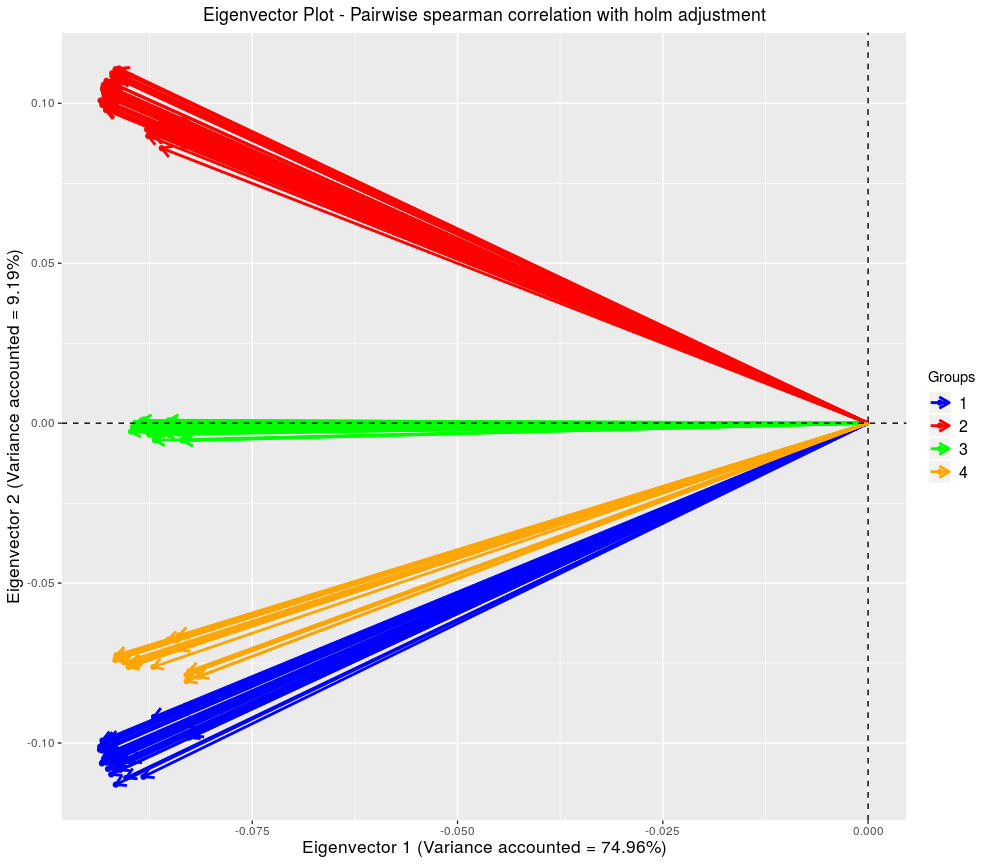

# BiocompR
BiocompR is a R package build upon ggplot2 to improve commonly used plots dedicated to data comparison, dataset exploration and, ultimately provides users with versatile and customizable graphics.  

**Author: PAGEAUD Y.<sup>1</sup>**  
**Contributors: MAYAKONDA A.<sup>2</sup>; WURSTHORN A.<sup>3</sup>; TOTH R.<sup>2</sup>; LUTSIK P.<sup>2</sup>**   
**1-** [**DKFZ - Division of Applied Bioinformatics, Germany.**](https://www.dkfz.de/en/applied-bioinformatics/index.php)  
**2-** [**DKFZ - Computational Cancer Epigenomics, Germany.**](https://www.dkfz.de/en/CanEpi/CompEpigen/index.html)  
**3-** [**DKFZ - .**]()  

**Version: 0.0.1**  
**R Compatibility: Version 3.6.1**  
**Last Update: 18/09/2019**  

## Content
Currently the BiocompR repository contains **9 scripts** in the folder **src/**:
* `eva.R` - to run an EVA (EigenVector Analysis).  
* `fused_plot.R` - to create a fused plot. It depends on 2 other scripts:  

  - `core_ggplot_fun.R` - contains several plotting functions.  
  - `core_stat_tests.R` - contains functions to run statistic tests.  
* `GG_Cluster_Heatmap.R` - to plot clustered heatmaps.  
* `ggcoverage.R` - to create simple enriched barplots.  
* `ggcraviola.R` - to create craviola plots (splitted & binned violin plots).  

  - `bin_polygons.R` - to cut ggplot2 polygons following specified quantiles.  
* `sunset.R` - to create a sunset plot (dodge barplot of completeness of a data.frame/matrix).  

## Prerequesites
### Install all dependencies

```R
Imports = c('ggplot2','psych','data.table','gridExtra','grid','parallel',
	    'ggrepel','corrplot','ggdendro','fastcluster','parallelDist',
	    'IRanges','RColorBrewer','Hmisc','gtools')
lapply(Imports, library, character.only = T)
```

⚠️ RColorBrewer, Hmisc and gtools will be removed in the next commits.

## Installing
⚠️ For now there is no package built, so nothing to install.

## Documentation
### EVA()
**Description:** From a Correlation test return eigenvectors, principal components scores and principal components correlations with the data.  
**Parameters:**  
* **_data_** - A matrix or a data.frame containing variables by columns and values to be used for the correlation test by rows.  
* **_use_** -  A character to specify how to handle missing values when calculating a correlation. Possible values are 'pairwise' and 'complete'. 'pairwise' is the default value and will do pairwise deletion of cases. 'complete' will select just complete cases.  
* **_method_** - The correlation method to use as a character matching one of these: 'pearson','spearman','kendall'.  
* **_adjust_** - A character specifying what adjustment for multiple tests should be used. Possible values are: "holm", "hochberg", "hommel", "bonferroni", "BH", "BY", "fdr" and "none".  
* **_var.min_** - A double setting the minimum variance accountable for an eigenvector to be considered in the plots generated.  
* **_groups_** - A character vector of groups to which variables belong for eigenvector annotations. The length of this vector has to match the number/variables of columns in the data.  
* **_colors_** - A character vector of colors for the eigenvectors. The length of this vector has to match the number of different groups existing.  

⚠️ **Work in progress !**

## Tutorial
### How to run an EVA (EigenVector Analysis)

For this tutorial we need the package **mixOmics** that can be installed from [**Biocondutor**](https://www.bioconductor.org/packages/release/bioc/html/mixOmics.html).

Once installed, load **mixOmics**:  

```R
library(mixOmics)
```

Load the 'stemcells' dataset:  

```R
data("stemcells")
df.stemc<-t(data.frame(stemcells$gene))
df.stemc<-df.stemc[,c(73,74,35,36,108,109,50,51,27,28)]
```

For this demonstration we will only use 10 samples.  
The dataset contains values of 400 Ensembl gene IDs.  
Load the script containing the EVA functions:
```R
source("BiocompR/src/eva.R")
```
Now let's run an EVA based on a pairwise pearson correlation between the samples:  
```R
eva.res<-EVA(data = df.stemc, use = "pairwise", method = "pearson",
             adjust = "none",var.min = 10^-3,
             groups = c(rep("G1",2),rep("G2",2),rep("G3",2),rep("G4",2),
                        rep("G5",2)),
             colors = c("blue","red","pink","green","orange"))
```
We don't set any adjustment (`adjust = "none"`).  
The minimum variance of an eigenvalue to be considered for the plotting has to be above 10<sup>-3</sup> (`var.min =  10^-3`).  
5 groups are specified from G1 to G5.
5 colors matching the groups are specified (`colors = c("blue","red","pink","green","orange")`).  

Check the eigenvector plot based on Eigenvectors 2 and 3:  
```R
eva.res$EV.plots$`2 & 3`
```

<p align="center">

</p>

Check the correlation between each eigenvector and the selected samples:
```R
eva.res$PC.cor

                 EV1        EV2         EV3         EV4         EV5          EV6          EV7          EV8          EV9         EV10
sample115 -0.8303877  0.2491523  0.45039591 -0.15160967  0.11510217  0.020542017 -0.008006845  0.002219612 -0.093755029  0.002816303
sample116 -0.8270994  0.2449026  0.45187351 -0.16403087  0.12603837 -0.025274282  0.004504351 -0.002762346  0.090898250 -0.004324801
sample35  -0.8228492 -0.4842983  0.17619773 -0.11148536 -0.17350399  0.119256559  0.014262570 -0.009394247  0.016626372  0.002438156
sample36  -0.8256010 -0.4932166  0.16062430 -0.06953648 -0.17018460 -0.122330139 -0.013803324  0.010029179 -0.015974597 -0.003344473
sample150 -0.8593873  0.4008005  0.02999788  0.27233104 -0.11884120 -0.014124179  0.104639519 -0.020549451 -0.006475418 -0.003454545
sample151 -0.8632567  0.3901246  0.01701053  0.27611832 -0.12041156  0.019294957 -0.102296139  0.024108381  0.010683778  0.005380210
sample50  -0.8255276  0.1988074 -0.46570724 -0.23774594 -0.01220768 -0.010092492  0.003149189 -0.011115658  0.002349743  0.071996669
sample51  -0.8165952  0.2131105 -0.47809691 -0.23148915 -0.01704860  0.005653178 -0.002983466  0.011698087 -0.003840261 -0.071478929
sample27  -0.8826688 -0.3435637 -0.16771132  0.18893930  0.17164856 -0.003707339 -0.026506293 -0.093690731 -0.002622042 -0.008382416
sample28  -0.8738047 -0.3660553 -0.16354698  0.17948951  0.18541211  0.010507487  0.027692799  0.090479404  0.002324763  0.007611173
```
It can be interesting to see if any sample annotation match the sign of correlations with a given eigenvector to speculate on the influence of known biological / clinical /technical sources of variability.

Check principal component scores of some genes:
```R
head(eva.res$PC.scores)

                       EV1        EV2         EV3        EV4        EV5         EV6          EV7         EV8         EV9        EV10
ENSG00000159199 -2.0246248 -0.5528220 -1.00930041  0.2471116 -0.1336578  0.04290066  0.001005254  0.01905857  0.04044745  0.04081912
ENSG00000106012  2.9909195 -1.0092463 -1.36802684 -0.6619587 -0.1415367  0.05128401 -0.122519295 -0.07243510 -0.10463717 -0.12469102
ENSG00000129317 -0.4979149  0.6378724  0.01573723 -0.4529912 -0.2574748 -0.06799586 -0.090245910 -0.04900360 -0.05098465 -0.17514404
ENSG00000075884  3.1443091  0.7550371  1.65414982  0.8340830  0.1546381  0.05009212  0.035017256  0.04395436 -0.16225866 -0.08159222
ENSG00000189367  1.4103769  1.6848047  0.22572101 -0.2093240 -0.0700232  0.14676420 -0.164126624 -0.11752260 -0.07926383  0.17872138
ENSG00000198542  0.3827579 -1.5375213  2.63838010 -2.4830413 -0.4560858 -0.31945756 -0.104490615  0.17904389 -0.08853756  0.05352093
```
One can then plot these genes following their scores for a set of selected eigenvectors.  
Here the 5 first eigenvectors are selected (the package **GGally** is necessary for the demonstration):  
```R
library(GGally)
ggfacet(eva.res$PC.scores[,c(1:5)]) + geom_density_2d()
```

<p align="center">

</p>


As one can see the first eigenvectors discriminate specific genes more strongly than latest ones.  

Finally one can select the Top10 most interesting genes following their scores for all eigenvectors:
```R
res.abs<-apply(X = eva.res$PC.scores, MARGIN = 1:2,FUN = abs)
top10.gene.IDs<-rownames(eva.res$PC.scores[order(rowSums(res.abs, na.rm = TRUE),
                                                 decreasing = TRUE),][1:10,])
top10.gene.IDs

 [1] "ENSG00000240970" "ENSG00000123080" "ENSG00000146674" "ENSG00000110696" "ENSG00000168542"
 [6] "ENSG00000181449" "ENSG00000120211" "ENSG00000136634" "ENSG00000125743" "ENSG00000148297"

```
This is only an example, it doesn't mean that the parameters set here are the best ones for these data.  

⚠️ **Work in progress !**  

## Licence

The repository BiocompR is currently under the GPL-3.0 licence.  

