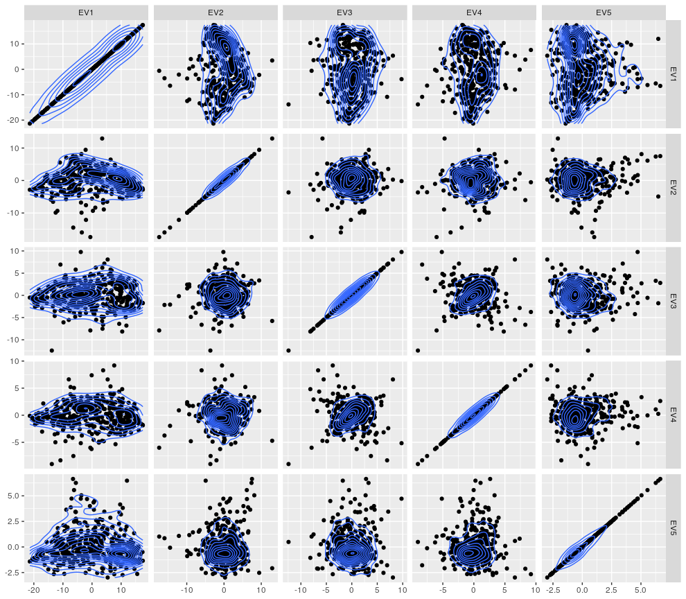

# BiocompR
_**BiocompR** is an R package built upon ggplot2 to improve commonly used plots dedicated to data comparison and dataset exploration and ultimately provides users with versatile and customizable graphics._  

**Author: PAGEAUD Y.<sup>1</sup>**  
**Contributors: SCHEFZIK R.<sup>2</sup>; MAYAKONDA A.<sup>3</sup>; WURSTHORN A.<sup>4</sup>; FEUERBACH L.<sup>1</sup>; TOTH R.<sup>3</sup>; HONG C.<sup>1</sup>.**  
**1-** [**DKFZ - Division of Applied Bioinformatics, Germany.**](https://www.dkfz.de/en/applied-bioinformatics/index.php)  
**2-** [**Klinik für Anästhesiologie und Operative Intensivmedizin, Medizinische Fakultät Mannheim, Universität Heidelberg, Germany.**](https://www.umm.de/klinik-fuer-anaesthesiologie-und-operative-intensivmedizin/)  
**3-** [**DKFZ - Computational Cancer Epigenomics, Germany.**](https://www.dkfz.de/en/CanEpi/CompEpigen/index.html)  
**4-** [**DKFZ - Clinical Cooperation Unit Translational Radiation Oncology, Germany.**](https://www.dkfz.de/en/molekulare-radioonkologie/index.php)  

**Version: 0.0.35 (Beta)**  
**R Compatibility: Version 3.6.1**  
**Last Update: 23/01/2020**  

## Content
Currently the package BiocompR contains **12 functions**:

* `basic.sidebar()` - Draws a ggplot2 of a basic sidebar.  
* `EVA()` - Computes eigenvectors, principal component scores and correlations from a correlation test.  
* `fancy.hist()` - Computes in parallel and plot an histogram using ggplot2 from a given vector of values.  
* `fused.plot()` - Creates a plot summarizing results from 2 different pairwise comparisons.  
* `fused.view()` - Displays 2 matrices of results as a fused plot.  
* `ggcoverage()` - Plots an annotated barplot.  
* `ggcraviola()` - Draws a craviola plot (half-splitted and percentile-binned violin plot).  
* `ggdend()` - Creates a dendogram in ggplot2.  
* `ggeigenvector()` - Creates an eigenvector plot using ggplot2.  
* `plot.col.sidebar()` - Creates a colored side annotation bars in ggplot2.  
* `resize.grobs()` - Resizes heights or widths of multiple grobs based on a given grob dimensions.  
* `sunset()` - Draws a sunset plot showing the completeness of a dataset.  

## Prerequesites
### Install all dependencies

```R
inst.pkgs = c('corrplot', 'data.table', 'devtools', 'fastcluster', 'ggdendro',
	      'ggplot2', 'ggrepel', 'grid', 'gridExtra', 'IRanges', 'psych',
	      'parallel', 'parallelDist', 'quantmod')
install.packages(inst.pkgs)
```

## Installing
1. Open BiocompR.Rproj in RStudio.
2. In RStudio console, type:
```R
devtools::install()
```

## Tutorial
### How to run an eigenvector anaylsis (EVA)

⚠️ **Please check the beginning of this section again!**  
```diff
+ An eigenvector analysis is a principal component analysis (PCA) except that the principal components are eigenvectors of a correlation matrix.  
+ Its main advantage is that the correlation method can be specified, as well as the adjustment method for multiple testing.  
```
It returns three types of results:  
* a list of eigenvector plots,  
* a table showing the correlation values between eigenvectors and selected variables,  
* a table showing the score of the data for each eigenvector.  

For this tutorial we need the package **mixOmics** that can be installed from [**Biocondutor**](https://www.bioconductor.org/packages/release/bioc/html/mixOmics.html).

Once installed, we load **mixOmics**:  

```R
library(mixOmics)
```

We load the 'stemcells' dataset:  

```R
data("stemcells")
summary(stemcells$study)
summary(stemcells$celltype)
```
The dataset contains expression data from four studies.  
Three different cell types are compared: Fibroblasts, human Embryonic Stem Cells (hESC) and human induced Pluripotent Stem cells (hiPS).  
To assess differences between these cell types, expression data of 400 genes is studied in 125 samples: 30 Fibroblasts, 37 hESC and 58 hiPS.  

Let's start by storing all expression data in a dataframe:
```R
df.stemc<-t(data.frame(stemcells$gene))
```
Load BiocompR:
```R
library(BiocompR)
```
Now let's run an EVA !  
Exemplarily, our EVA will be based on a Spearman correlation (**method** = "spearman") between the samples.  
Missing values will be removed following a pairwise deletion for each pair of compared samples (**use** = "pairwise").  
We will use the Holm adjusment method for multiple testing (**adjust** = "holm").  
We will only consider eigenvalues with a minimum variance accountability of 10<sup>-3</sup>.  
In this first analysis samples will be grouped by studies (**groups** = studies).  
Samples will be colored in blue, red, green and orange following the study they belong to (**colors** = c("blue","red","green","orange")).  
As there are a lot of samples, we will not label sample IDs (**label** = FALSE).  
The final command for the exemplary setting then looks as follows:  
```R
eva.study<-EVA(data = df.stemc, use = "pairwise", method = "spearman",
               adjust = "holm", var.min = 10^-3, groups = stemcells$study,
               colors = c("blue","red","green","orange"), label = FALSE)
```
We check the eigenvector plot based on eigenvectors 1 and 2:  
```R
eva.study$EV.plots$`1 & 2`
```

<p align="center">

</p>

Samples from the four studies are clearly separated and grouped together by the 2nd eigenvector. The associated accounted variance is equal to 9.19% of the total variance. This share of the variance could possibly be explained by technical bias existing between studies.

 
Let's check the correlation between the first five principal components (or first five eigenvectors) for eight samples, two from each study:
```R
eva.study$PC.cor[c(1,21,39,45,60,72,111,114),1:5]

                 EV1          EV2          EV3        EV4          EV5
sample1   -0.8951883 -0.270063307 -0.022292016 -0.0678189  0.021730638
sample21  -0.8772897 -0.277837669 -0.007358484 -0.0794286 -0.037385112
sample39  -0.8663426 -0.001890668  0.368653214  0.3240846 -0.022192641
sample45  -0.8593002  0.003487241  0.319675840  0.3602473 -0.027747364
sample102 -0.8915803  0.343632835  0.050768567 -0.1466372  0.007248045
sample114 -0.8066130  0.312796767 -0.304392402  0.2183301 -0.015844224
sample153 -0.8118068 -0.177573462 -0.205558201  0.2889839  0.296801713
sample156 -0.7894227 -0.218359094 -0.144346190  0.1110516  0.453881389
```
It may be interesting to see if any sample annotation matches the sign of correlations with a given eigenvector to speculate on the influence of known biological, clinical or technical sources of variability.

We check the first five principal component scores of some genes:
```R
head(eva.study$PC.scores[,1:5])

                      EV1        EV2        EV3        EV4        EV5
ENSG00000159199 -7.511113 -2.9810886  2.2514981 -1.1580432 -1.4801993
ENSG00000106012  9.535193 -5.2277593  2.9507172  2.4259599  0.2770715
ENSG00000129317 -1.402454  1.6243366  1.6428285  1.7017169  1.5867111
ENSG00000075884 11.154868  2.9302000 -3.4370837 -3.5778084 -1.1826668
ENSG00000189367  6.390328  6.4396160  0.7661937 -0.7968169 -2.3035510
ENSG00000198542  7.630721 -0.5296745 -3.7407614  9.1858624 -2.6607522
```
One can then plot the scores of these genes for a set of selected eigenvectors.  
Here the first five eigenvectors are selected (the package **GGally** is necessary for the demonstration):  
```R
library(GGally)
ggfacet(eva.study$PC.scores[,c(1:5)]) + geom_density_2d()
```

<p align="center">

</p>


The first eigenvectors discriminate specific genes more strongly than later ones.  

Finally one can select the Top10 most interesting genes following their scores for the first five and most important eigenvectors:
```R
res.abs<-apply(X = eva.res$PC.scores, MARGIN = 1:2,FUN = abs)
top10.gene.IDs<-rownames(eva.res$PC.scores[order(rowSums(
  res.abs[,1:5], na.rm = TRUE), decreasing = TRUE),][1:10,])
top10.gene.IDs

 [1] "ENSG00000240970" "ENSG00000120211" "ENSG00000136634" "ENSG00000181449"
 [5] "ENSG00000110696" "ENSG00000148297" "ENSG00000125743" "ENSG00000163661"
 [9] "ENSG00000123080" "ENSG00000111700"
```
Now a similar EVA can be done using the cell types. Principal component correlations and scores will remain the same as in the previous analysis, only the plotting will be different:
```R
eva.cells<-EVA(data = df.stemc, use = "pairwise", method = "spearman",
             adjust = "holm",var.min = 10^-3, groups = stemcells$celltype,
             colors = c("blue","red","green"), label = FALSE)
```

While the 1st and 2nd eigenvectors were useful to separate sample from different studies, it is more interesting to look at the 2nd and the 3rd eigenvectors when it comes to cell types:
```R
eva.cells$EV.plots$`2 & 3`
```

<p align="center">

</p>

Fibroblasts appear to be clearly grouped together, while hESC and hiPS are mixed together in the same groups. Knowing that hiPS are supposed to have very similar properties than hESCs, this analysis confirm that there is no visible difference between hESC and hiPS when looking at the first three eigenvectors. While the 3rd eigenvector seems to almost separate Fibroblasts from hESC and hiPS, what the 2nd eigenvector represents is unclear.

So is there any eigenvector being able to discriminate hESC and hiPS?  
When looking at the different plots computed, it appears that the eigenvector 7 manages to discriminate some hiPS samples from hESC samples, but not completely:
```R
eva.cells$EV.plots$`2 & 7`
```

<p align="center">

</p>

Among the selected 16 eigenvectors, the eigenvector 7 manages best to separate some hiPS from the hESC.  
We can then have a look at which genes could be associated to the remaining difference existing between hiPS and hESC (since the dataset did not change, we can reuse previous data):
```R
top10.hiPSgene.IDs<-rownames(eva.res$PC.scores[
  order(res.abs[,7], decreasing = TRUE),][1:10,])
top10.hiPSgene.IDs

 [1] "ENSG00000040731" "ENSG00000168542" "ENSG00000108511" "ENSG00000164093"
 [5] "ENSG00000110169" "ENSG00000138685" "ENSG00000242265" "ENSG00000123080"
 [9] "ENSG00000148053" "ENSG00000162849"
```

These results might mean that the differential expression of genes listed above probably explains some differences between hiPS and hESC cells.  

This tutorial is only an example, it doesn't mean that the parameters set here are the best ones for these data and we encourage everyone to play with them to see how eigenvector analyses could be improved.  

⚠️ **Work in progress !**  

## Known Issues ⚠️
```R
Error in UseMethod("depth") : 
  no applicable method for 'depth' applied to an object of class "NULL"
```
This error seems to happen randomly when executing code using the ggplot2 and/or grid packages. Usually executing one more time the chuck of code solve the error. The current status of this issue can be tracked [**here**](https://github.com/tidyverse/ggplot2/issues/2514).

## References
⚠️ **Work in progress !**  

## Licence

The repository BiocompR is currently under the GPL-3.0 licence.  

